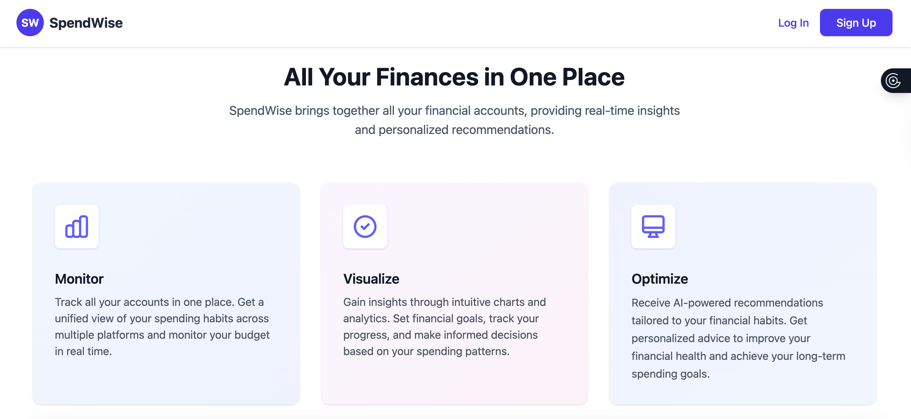
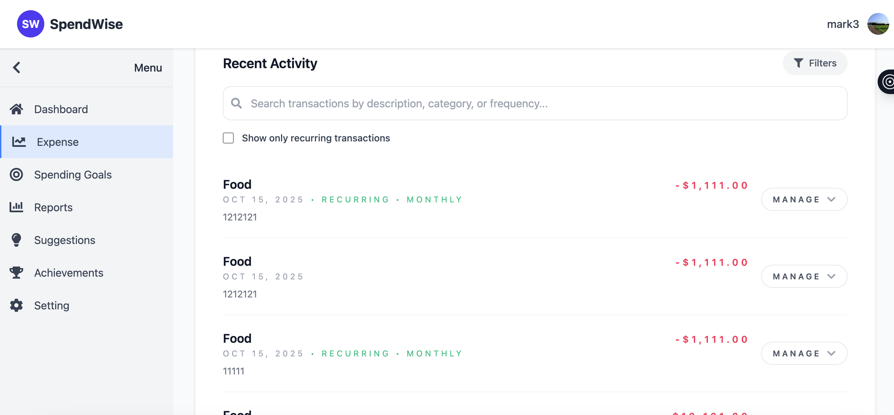
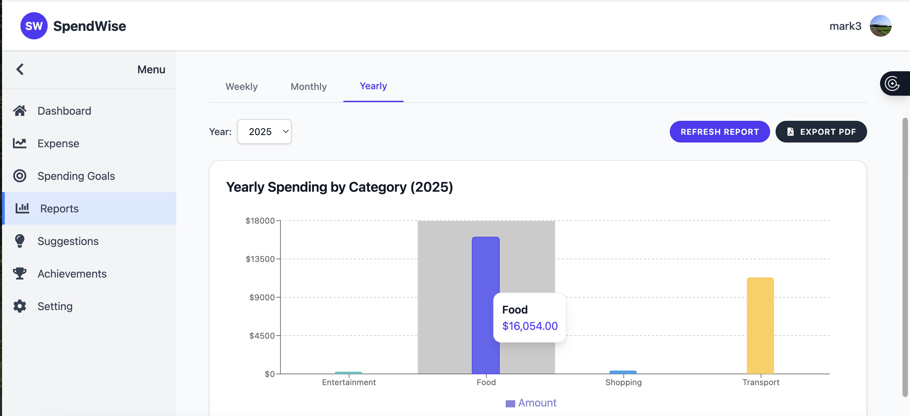
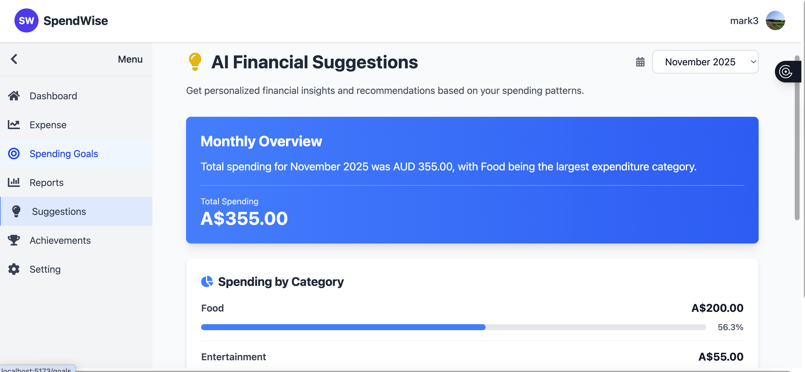
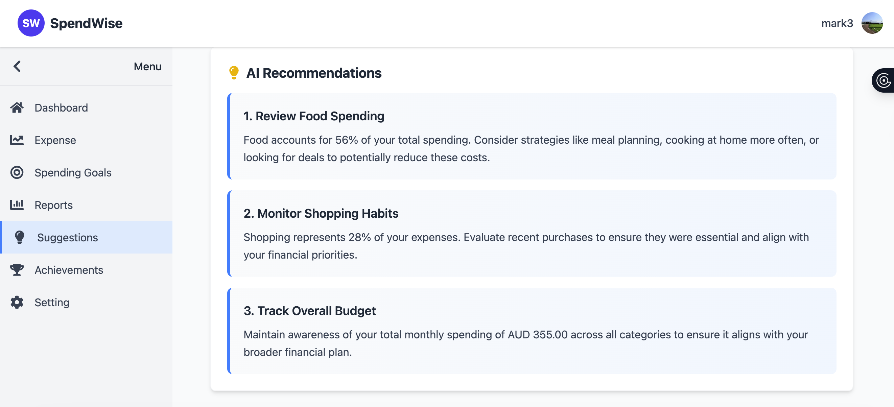
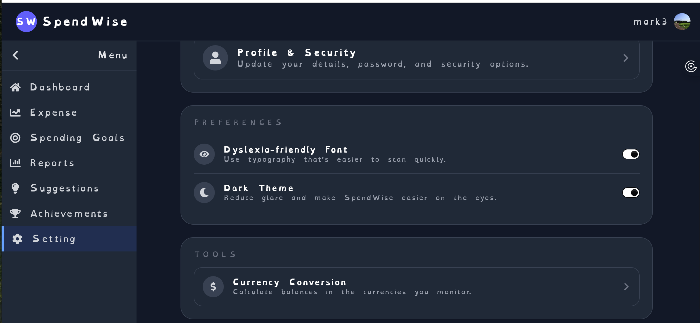
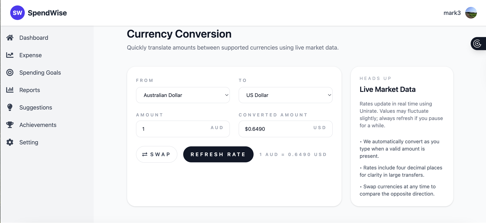

# Personal Finance and Budget Tracker

Nowadays, it can be very time-consuming and confusing to keep track of one's personal finances and budget goals, as people often have multiple accounts (bank accounts, cash, etc.) scattered across various platforms. Without a unified view, it becomes complicated to visualize spending habits, set realistic financial targets, and seek timely advice to stay on top of spending goals.

To address these challenges, our project offers an intuitive platform that brings all the financial information together such as monitoring user's budget in real time and receive AI-powered recommendations tailored to their financial habits. Users can easily monitor their expenses, set and track spending goals, and receive personalized recommendations to improve their financial health while being able to seek for spending advice. Our key features include a secure login system, a central dashboard with a monthly overview, a detailed history of transactions, visual spending analysis through charts, and a personalised AI recommendation chat. We believe real time analytics into managing personal finances can be simpler and more transparent in order to achieve users' long term financial objectives. Moreover, users will also be able to customize and set their spending goals along with alerts that reminds users to be cautious with their spending habits. Our high level goal is to make personal finance management accessible and proactive providing users the motivation they need to build a healthier financial habit and achieve their long term goals.

---

## Table of Contents

1. [Login/Sign Up Navigation](#1-login-sign-up-navigation-page)
2. [Dashboard (Home Page)](#2-dashboard-home-page)
3. [History](#3-history)
4. [Expense Tracking](#4-expense-tracking)
5. [AI Recommendation Chat](#5-ai-recommendation-chat)
6. [Spending Goals](#6-spending-goals)
7. [Analytics of Current Data](#7-analytics-of-current-data)
8. [Settings](#8-settings)
9. [Tech Stack](#tech-stack)
10. [Key Features](#key-features)


---

## 1. Login/Sign Up Navigation Page

- User authentication (sign-up, login)
- Secure password handling using bcrypt to prevent data breaches
- JWT tokens for secure user sessions
- Implementing caching to improve performance and reduce loading times

---

## 2. Dashboard (Home Page)

- **Monthly Overview**
  - Easily add new transactions
  - Track progress towards spending goals

---

## 3. History

- View a table of all historical transactions
- Add new transactions directly from the history view

---

## 4. Expense Tracking

- Visualise spending with pie and bar charts
- Quickly see which categories most expenses belong to

---

## 5. AI Recommendation Chat

- Integrates with the Gemini API to provide tailored financial recommendations based on the user’s data
- Real-time chat interface for financial guidance
- Chat history page to review previous conversations and advice

---

## 6. Spending Goals

- Set targeted spending budgets
- Monitor progress for each goal

---

## 7. Analytics of Current Data

- Detailed breakdown and analysis for each goal
- Insights into spending patterns

---

## 8. Settings

- Edit profile information
- Change password
- Adjust monthly budget restrictions

---

## Tech Stack

- **Frontend:** React, Node.js
- **Backend:** Java Spring boot
- **Database:** PostgreSQL
- **Related APIs:** Gemini API

---

## Key Features

- AI-integrated recommendations (Gemini API / prompt engineering)
- Pop-up notifications for overspending
- Secure user authentication and password hashing for privacy
- Visual analysis (pie/bar charts) for spending
- Filtering options for transaction history
- Customisable spending goals and progress tracking
- Responsive UI/UX for various devices (phones, tablets, laptops)
- Option to import past spending data

---


## 12. Local Installation

This guide will help you set up and run the Personal Finance and Budget Tracker on your local machine.

### Prerequisites

Before you begin, ensure you have the following installed on your system:

- **Java 17 or higher** - Required for Spring Boot backend
- **Node.js** (v16 or higher) and **npm** - Required for React frontend  
- **PostgreSQL** (v12 or higher) - Required for database
- **Git** - To clone the repository

### Installation Steps

#### 1. Clone the Repository

```bash
git clone <your-repository-url>
cd Spendwise
```

#### 2. Database Setup

1. **Install PostgreSQL** (if not already installed):
   - **macOS**: `brew install postgresql`
   - **Ubuntu/Debian**: `sudo apt-get install postgresql postgresql-contrib`
   - **Windows**: Download from [PostgreSQL official website](https://www.postgresql.org/download/)

2. **Start PostgreSQL service**:
   - **macOS**: `brew services start postgresql`
   - **Linux**: `sudo systemctl start postgresql`
   - **Windows**: Start via Services or pgAdmin

3. **Create the database**:
   ```sql
   -- Connect to PostgreSQL as superuser
   psql -U postgres
   
   -- Create database
   CREATE DATABASE spendwise;
   
   -- Create user (optional, or use existing postgres user)
   CREATE USER spendwise_user WITH PASSWORD 'your_password';
   GRANT ALL PRIVILEGES ON DATABASE spendwise TO spendwise_user;
   
   -- Exit
   \q
   ```

#### 3. Backend Setup (Spring Boot)

1. **Navigate to backend directory**:
   ```bash
   cd backend
   ```

2. **Configure database connection**:
   Edit `src/main/resources/application.properties`:
   ```properties
   spring.datasource.url=jdbc:postgresql://localhost:5432/spendwise
   spring.datasource.username=postgres
   spring.datasource.password=your_password
   
   # Optional: Add your Gemini API key for AI features
   gemini.apiKey=your_gemini_api_key_here
   ```

3. **Install dependencies and run**:
   ```bash
   # Using Maven wrapper (recommended)
   ./mvnw clean install
   ./mvnw spring-boot:run
   
   # Or using system Maven
   mvn clean install
   mvn spring-boot:run
   ```

   The backend will start on `http://localhost:8080`

#### 4. Frontend Setup (React)

1. **Open a new terminal** and navigate to frontend directory:
   ```bash
   cd frontend
   ```

2. **Install dependencies**:
   ```bash
   npm install
   ```

3. **Start development server**:
   ```bash
   npm run dev
   ```

   The frontend will start on `http://localhost:5173`

### Verification

1. **Backend API**: Visit `http://localhost:8080/api` to check if the backend is running
2. **Frontend**: Visit `http://localhost:5173` to access the application
3. **Database**: Check that tables are created automatically in your PostgreSQL database

### Environment Configuration

#### Backend Environment Variables (Optional)

Create a `.env` file in the backend directory or set environment variables:

```bash
# Database
DB_URL=jdbc:postgresql://localhost:5432/spendwise
DB_USERNAME=postgres
DB_PASSWORD=your_password

# Gemini API (for AI features)
GEMINI_API_KEY=your_gemini_api_key_here
```

#### Frontend Environment Variables (Optional)

Create a `.env` file in the frontend directory:

```bash
VITE_API_BASE_URL=http://localhost:8080/api
```

### Troubleshooting

#### Common Issues:

1. **PostgreSQL Connection Error**:
   - Ensure PostgreSQL is running: `brew services list | grep postgresql`
   - Check database credentials in `application.properties`
   - Verify database exists: `psql -U postgres -l`

2. **Port Already in Use**:
   - Backend (8080): Change port in `application.properties`: `server.port=8081`
   - Frontend (5173): Vite will automatically try the next available port

3. **Java Version Issues**:
   - Check Java version: `java -version`
   - Ensure Java 17+ is installed and set as default

4. **Node.js/npm Issues**:
   - Check versions: `node -v` and `npm -v`
   - Clear npm cache: `npm cache clean --force`
   - Delete `node_modules` and run `npm install` again

### Development Scripts

#### Backend:
```bash
# Run tests
./mvnw test

# Package application
./mvnw package

# Run with specific profile
./mvnw spring-boot:run -Dspring-boot.run.profiles=dev
```

#### Frontend:
```bash
# Development server
npm run dev

# Build for production
npm run build

# Preview production build
npm run preview

# Lint code
npm run lint
```

### Production Deployment Notes

For production deployment, you'll need to:

1. Build the frontend: `npm run build`
2. Package the backend: `./mvnw package`
3. Configure production database settings
4. Set up proper environment variables
5. Configure reverse proxy (nginx) if needed

### Getting Started

1. Start PostgreSQL service
2. Run the backend: `cd backend && ./mvnw spring-boot:run`
3. Run the frontend: `cd frontend && npm run dev`
4. Open your browser to `http://localhost:5173`
5. Create an account and start tracking your finances!

For any issues or questions, please check the troubleshooting section above or refer to the project documentation.


**Pictures**








